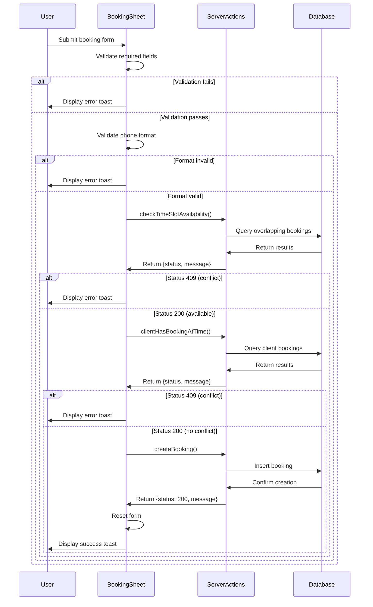

# Design Document: Booking Error Handling

## Overview

This design specifies the implementation of comprehensive error handling for the BookingSheet component in the BarberBrand SaaS platform. The enhancement replaces inconsistent error feedback mechanisms (mix of `toast.warning()` and `alert()`) with a unified Sonner toast-based approach, implements structured Server Action responses with HTTP status codes, and adds comprehensive client-side validation with an early exit pattern.

The design addresses three key areas:
1. **Client-side validation**: Immediate feedback on invalid inputs before server communication
2. **Server Action response structure**: Standardized responses with HTTP status codes for proper error categorization
3. **User feedback consistency**: Unified toast notifications for all user-facing messages

This enhancement improves user experience by providing clear, actionable feedback and reduces server load by catching validation errors early on the client side.

## Architecture

### High-Level Architecture

The booking flow follows a layered validation approach:

```
User Input → Client Validation → Server Actions → Database
     ↓              ↓                   ↓             ↓
  Toast         Toast              Toast         Success
  Error         Error              Error         Toast
```

### Component Interaction Flow



### Validation Order

The validation follows a strict early exit pattern:

1. **Required fields validation** - Check all fields are non-empty
2. **Field-specific validation** - Validate individual field formats (phone number)
3. **Business hours validation** - Ensure time is within operating hours
4. **Time slot availability** - Check if barber is available
5. **Duplicate booking check** - Verify client doesn't have overlapping booking
6. **Booking creation** - Create the booking record

Each step must pass before proceeding to the next. Any failure results in immediate error display and process termination.

## Components and Interfaces

### 1. BookingSheet Component (Client)

**File**: `src/app/[slug]/_components/BookingSheet.tsx`

**Responsibilities**:
- Render booking form UI
- Manage form state (date, barber, time, customer info)
- Perform client-side validation
- Call Server Actions and handle responses
- Display toast notifications
- Manage loading states

**State Management**:
```typescript
interface BookingSheetState {
  date: Date | undefined;
  selectedBarber: string;
  selectedTime: string;
  customerName: string;
  customerPhone: string;
  isSubmitting: boolean;
}
```

**Key Methods**:

```typescript
// Main submission handler with validation chain
async function handleBookingSubmit(): Promise<void>

// Validation helpers
function validateRequiredFields(): boolean
function validatePhoneFormat(phone: string): boolean
function validateBusinessHours(time: string): boolean
```

**Toast Usage**:
- `toast.error(message)` - For all validation and server errors
- `toast.success(message)` - For successful booking creation
- `toast.info(message)` - For long-running operations (>3 seconds)

### 2. Server Actions

**File**: `src/app/_actions/create-booking.ts`

**Response Interface**:
```typescript
interface ServerActionResponse {
  status: 200 | 400 | 409 | 500;
  message: string;
  data?: any; // Optional, for successful responses
}
```

**Status Code Meanings**:
- `200` - Success
- `400` - Validation error (bad request)
- `409` - Conflict (time slot taken, duplicate booking)
- `500` - Server error (database failure, unexpected error)

#### checkTimeSlotAvailability

**Purpose**: Verify if a time slot is available for the selected barber

**Input**: `CreateBookingParams`

**Output**: `ServerActionResponse`

**Logic**:
1. Calculate end time based on start time + duration
2. Query database for overlapping bookings for the barber
3. Return status 200 if no overlaps, 409 if conflicts exist
4. Return status 500 on database errors

**Response Examples**:
```typescript
// Available
{ status: 200, message: "Time slot is available" }

// Conflict
{ status: 409, message: "Time slot is already booked" }

// Error
{ status: 500, message: "Unable to check availability" }
```

#### clientHasBookingAtTime

**Purpose**: Check if the client already has a booking at the requested time

**Input**: `CreateBookingParams`

**Output**: `ServerActionResponse`

**Logic**:
1. Calculate end time based on start time + duration
2. Query database for overlapping bookings by customer phone
3. Return status 200 if no conflicts, 409 if client has overlapping booking
4. Return status 500 on database errors

**Response Examples**:
```typescript
// No conflict
{ status: 200, message: "No existing booking found" }

// Conflict
{ status: 409, message: "Client has existing booking at this time" }

// Error
{ status: 500, message: "Unable to verify existing bookings" }
```

#### createBooking

**Purpose**: Create a new booking record in the database

**Input**: `CreateBookingParams`

**Output**: `ServerActionResponse`

**Logic**:
1. Calculate end time
2. Create booking record in database
3. Revalidate the barbershop page path
4. Return status 200 on success
5. Return status 500 on database errors

**Response Examples**:
```typescript
// Success
{ status: 200, message: "Booking created successfully" }

// Error
{ status: 500, message: "Failed to create booking" }
```

## Data Models

### CreateBookingParams

```typescript
interface CreateBookingParams {
  serviceId: string;        // UUID of the service
  barberId: string;         // UUID of the selected barber
  barberShopId: string;     // UUID of the barbershop
  startTime: Date;          // Booking start time
  duration: number;         // Service duration in minutes
  customerName: string;     // Customer's name
  customerPhone: string;    // Customer's phone (+351 format)
}
```

### Validation Rules

**Customer Name**:
- Required: Yes
- Format: Non-empty after trimming whitespace
- Error message: "Please enter your name"

**Customer Phone**:
- Required: Yes
- Format: `/^\+351[1-9][0-9]{8}$/`
- Error message: "Please enter a valid phone number (format: +351 912345678)"

**Barber Selection**:
- Required: Yes
- Error message: "Please select a barber"

**Time Slot**:
- Required: Yes
- Business hours: 9:00 AM - 7:30 PM
- Error messages:
  - Not selected: "Please select a time slot"
  - Outside hours: "Please select a time between 9:00 AM and 7:30 PM"

**Date**:
- Required: Yes (defaults to today)
- Error message: "Please fill in all required fields"

## Error Handling

### Error Categories

1. **Validation Errors** (Client-side)
   - Empty required fields
   - Invalid phone format
   - Time outside business hours
   - Display: `toast.error(message)`
   - Action: Stop processing, keep form state

2. **Conflict Errors** (Server-side, status 409)
   - Time slot already booked
   - Client has overlapping booking
   - Display: `toast.error(message)`
   - Action: Stop processing, keep form state

3. **Server Errors** (Server-side, status 500)
   - Database connection failures
   - Unexpected errors
   - Display: `toast.error(message)` with generic user-friendly message
   - Action: Log detailed error server-side, stop processing

4. **Success** (Server-side, status 200)
   - Booking created successfully
   - Display: `toast.success(message)`
   - Action: Reset form to initial state

### Error Message Standards

All error messages must be:
- **In English** (per project coding guidelines)
- **User-friendly** (avoid technical jargon)
- **Actionable** (tell user what to do)
- **Specific** (identify the exact problem)

### Server-Side Error Logging

Server Actions must:
- Log full error details to console using `console.error()`
- Include error stack traces for debugging
- Return sanitized, user-friendly messages to client
- Never expose database schema or internal implementation details

Example:
```typescript
try {
  // Database operation
} catch (error) {
  console.error("Failed to create booking:", error);
  return { 
    status: 500, 
    message: "Failed to create booking. Please try again or contact support" 
  };
}
```

## Testing Strategy

### Testing Approach

This feature requires a dual testing approach combining unit tests for specific scenarios and property-based tests for comprehensive validation coverage.

**Unit Tests**: Focus on specific examples, edge cases, and integration points
- Specific error message validation
- Loading state transitions
- Form reset behavior
- Toast notification calls

**Property-Based Tests**: Verify universal properties across all inputs
- Validation logic correctness across random inputs
- Server Action response structure consistency
- Error handling completeness

### Testing Tools

**Unit Testing**:
- Framework: Jest (Next.js default)
- React Testing: React Testing Library
- Mocking: Jest mocks for Server Actions

**Property-Based Testing**:
- Library: fast-check (TypeScript property-based testing library)
- Configuration: Minimum 100 iterations per property test
- Each property test must reference its design document property via comment tag

### Test Organization

```
src/
  app/
    [slug]/
      _components/
        BookingSheet.tsx
        __tests__/
          BookingSheet.test.tsx          # Unit tests
          BookingSheet.properties.test.tsx  # Property-based tests
    _actions/
      create-booking.ts
      __tests__/
        create-booking.test.ts           # Unit tests
        create-booking.properties.test.ts # Property-based tests
```

### Unit Test Coverage

**BookingSheet Component**:
1. Renders form fields correctly
2. Displays validation errors for empty fields
3. Displays validation error for invalid phone format
4. Displays validation error for time outside business hours
5. Calls checkTimeSlotAvailability with correct parameters
6. Handles 409 response from checkTimeSlotAvailability
7. Calls clientHasBookingAtTime after availability check passes
8. Handles 409 response from clientHasBookingAtTime
9. Calls createBooking after all validations pass
10. Displays success toast on successful booking
11. Resets form after successful booking
12. Manages loading state during submission
13. Disables submit button during submission
14. Does not use alert() for any user feedback
15. Uses toast.error() for all error scenarios
16. Uses toast.success() for success scenarios

**Server Actions**:
1. checkTimeSlotAvailability returns 200 when slot is available
2. checkTimeSlotAvailability returns 409 when slot is taken
3. checkTimeSlotAvailability returns 500 on database error
4. clientHasBookingAtTime returns 200 when no conflict
5. clientHasBookingAtTime returns 409 when client has booking
6. clientHasBookingAtTime returns 500 on database error
7. createBooking returns 200 on success
8. createBooking returns 500 on database error
9. createBooking revalidates path on success
10. All Server Actions log errors to console

### Property-Based Test Configuration

Each property test must:
- Run minimum 100 iterations
- Include a comment tag: `// Feature: booking-error-handling, Property {N}: {property text}`
- Use fast-check generators for random input generation
- Verify the property holds for all generated inputs

Example tag format:
```typescript
// Feature: booking-error-handling, Property 1: For any whitespace-only string, validation should reject it as invalid
```


## Correctness Properties

*A property is a characteristic or behavior that should hold true across all valid executions of a system-essentially, a formal statement about what the system should do. Properties serve as the bridge between human-readable specifications and machine-verifiable correctness guarantees.*

### Property 1: Whitespace-only input rejection

*For any* required field (customerName, customerPhone) and any string composed entirely of whitespace characters, submitting the form should reject the input and display an appropriate error toast without calling any server actions.

**Validates: Requirements 2.2, 2.3**

### Property 2: Invalid phone format rejection

*For any* string that does not match the pattern `/^\+351[1-9][0-9]{8}$/`, when used as the customerPhone value, the form submission should reject the input and display the error toast "Please enter a valid phone number (format: +351 912345678)" without calling any server actions.

**Validates: Requirements 2.4**

### Property 3: Business hours validation

*For any* time value outside the range 9:00 AM to 7:30 PM (hours < 9 or hours >= 19 or (hours === 18 and minutes > 30)), the form submission should reject the input and display the error toast "Please select a time between 9:00 AM and 7:30 PM" without calling any server actions.

**Validates: Requirements 2.7**

### Property 4: Server action response structure consistency

*For any* server action call (checkTimeSlotAvailability, clientHasBookingAtTime, createBooking) and any input parameters, the response should always be an object containing a `status` field (with value 200, 400, 409, or 500) and a `message` field (with a non-empty string), where:
- Status 200 indicates success
- Status 400 indicates validation error
- Status 409 indicates conflict
- Status 500 indicates server error

**Validates: Requirements 3.1, 3.2, 3.3, 3.4, 3.5**

### Property 5: Error logging with user-friendly messages

*For any* server action that encounters an error, the server should log detailed error information (including stack trace) to the console using `console.error()`, while the response message returned to the client should be a user-friendly string that does not expose internal implementation details or database schema.

**Validates: Requirements 3.6**

### Property 6: Server error message passthrough

*For any* server action response with status code 400, the error message from the server should be displayed to the user in a toast.error() notification without modification.

**Validates: Requirements 6.2**

### Property 7: Form reset after successful booking

*For any* successful booking creation (createBooking returns status 200), the form fields (customerName, customerPhone, selectedBarber, selectedTime) should be reset to their initial empty state.

**Validates: Requirements 6.5**

### Property 8: Form state during async operations

*For any* server action execution (checkTimeSlotAvailability, clientHasBookingAtTime, createBooking), the submit button should be disabled and the form should prevent modifications while the action is executing, and should be re-enabled when the action completes (regardless of success or failure).

**Validates: Requirements 7.2, 7.3**

### Property 9: Early exit validation pattern

*For any* form submission with invalid input (empty required fields, invalid phone format, or time outside business hours), no server actions should be called, and the validation should stop at the first error encountered and display the appropriate error message.

**Validates: Requirements 9.2, 9.5**

