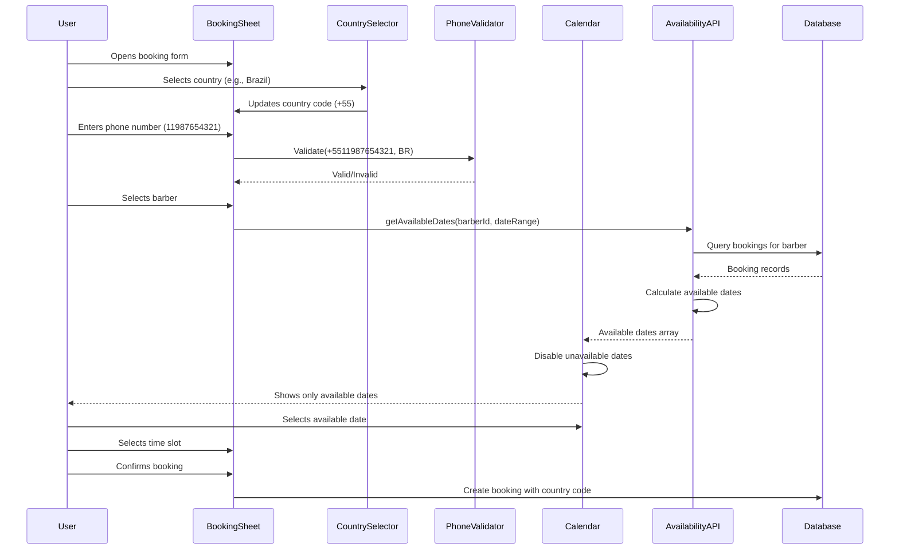

# Design Document: International Booking Enhancements

## Overview

This design introduces two key enhancements to the BarberBrand booking system: (1) International phone number support with a country selector allowing users from Portugal, Brazil, England, Germany, and France to book appointments with automatic country code prepending and country-specific validation, and (2) Smart calendar filtering that displays only dates where the selected barber has available time slots, preventing users from selecting fully booked dates and improving the booking experience.

## Main Algorithm/Workflow



## Core Interfaces/Types

```typescript
// Country configuration with validation patterns
interface CountryConfig {
  code: string;           // ISO 3166-1 alpha-2 code
  name: string;           // Display name
  dialCode: string;       // International dialing code
  phonePattern: RegExp;   // Validation regex for phone numbers
  placeholder: string;    // Example phone number format
  maxLength: number;      // Maximum digits allowed
}

// Phone number with country context
interface InternationalPhone {
  countryCode: string;    // e.g., "PT", "BR"
  dialCode: string;       // e.g., "+351", "+55"
  localNumber: string;    // e.g., "912345678"
  fullNumber: string;     // e.g., "+351912345678"
}

// Date availability information
interface DateAvailability {
  date: Date;
  isAvailable: boolean;
  availableSlots: number;
  totalSlots: number;
}

// Barber availability query parameters
interface AvailabilityQuery {
  barberId: string;
  startDate: Date;
  endDate: Date;
  serviceDuration: number;
}

// Barber availability response
interface AvailabilityResponse {
  barberId: string;
  availableDates: Date[];
  dateAvailability: Map<string, DateAvailability>; // ISO date string -> availability
}
```

## Key Functions with Formal Specifications

### Function 1: validateInternationalPhone()

```typescript
function validateInternationalPhone(
  localNumber: string,
  countryCode: string
): { isValid: boolean; fullNumber?: string; error?: string }
```

**Preconditions:**
- `localNumber` is a non-null string
- `countryCode` is a valid ISO 3166-1 alpha-2 code (PT, BR, GB, DE, FR)
- Country configuration exists for the provided `countryCode`

**Postconditions:**
- Returns object with `isValid` boolean
- If `isValid === true`: `fullNumber` contains formatted international number (e.g., "+351912345678")
- If `isValid === false`: `error` contains descriptive validation failure message
- No mutations to input parameters
- Result is deterministic for same inputs

**Loop Invariants:** N/A (no loops in function)

### Function 2: getBarberAvailableDates()

```typescript
async function getBarberAvailableDates(
  query: AvailabilityQuery
): Promise<AvailabilityResponse>
```

**Preconditions:**
- `query.barberId` is a valid UUID of an existing barber
- `query.startDate` <= `query.endDate`
- `query.serviceDuration` > 0 (in minutes)
- Date range does not exceed 90 days

**Postconditions:**
- Returns `AvailabilityResponse` with array of available dates
- `availableDates` contains only dates where at least one time slot is available
- `dateAvailability` map contains detailed slot information for each date in range
- Dates are in chronological order
- All dates in `availableDates` have `isAvailable === true` in `dateAvailability` map
- Function completes within 3 seconds for typical 30-day range

**Loop Invariants:**
- When iterating through dates: All previously processed dates have accurate availability calculations
- When iterating through time slots: Running count of available slots is non-negative

### Function 3: formatPhoneWithCountryCode()

```typescript
function formatPhoneWithCountryCode(
  localNumber: string,
  dialCode: string
): string
```

**Preconditions:**
- `localNumber` is a non-empty string containing only digits
- `dialCode` starts with "+" and contains only digits after the "+"
- `localNumber` has been validated against country-specific pattern

**Postconditions:**
- Returns concatenated string: `dialCode + localNumber`
- Result starts with "+"
- Result contains only "+" and digits
- Length equals `dialCode.length + localNumber.length`
- No whitespace in result

**Loop Invariants:** N/A (no loops in function)

### Function 4: calculateAvailableSlots()

```typescript
function calculateAvailableSlots(
  date: Date,
  existingBookings: Booking[],
  serviceDuration: number,
  businessHours: { start: number; end: number }
): string[]
```

**Preconditions:**
- `date` is a valid Date object
- `existingBookings` is an array of bookings for the specified date and barber
- `serviceDuration` > 0 (in minutes)
- `businessHours.start` < `businessHours.end` (e.g., 9 < 19)
- All bookings in `existingBookings` have valid `startTime` and `endTime`

**Postconditions:**
- Returns array of available time slot strings (e.g., ["09:00", "09:30", "10:00"])
- All returned slots are within business hours
- No returned slot overlaps with existing bookings
- Slots are in chronological order
- Each slot has sufficient duration for the service before next booking or end of business hours

**Loop Invariants:**
- When iterating through potential slots: All previously checked slots either added to result (if available) or skipped (if unavailable)
- Running time pointer never exceeds business hours end time
- No slot in result array overlaps with any booking

## Algorithmic Pseudocode

### Main Phone Validation Algorithm

```typescript
ALGORITHM validateInternationalPhone(localNumber, countryCode)
INPUT: localNumber (string), countryCode (string)
OUTPUT: ValidationResult { isValid, fullNumber?, error? }

BEGIN
  // Step 1: Retrieve country configuration
  countryConfig ← COUNTRY_CONFIGS[countryCode]
  
  ASSERT countryConfig !== undefined
  
  // Step 2: Clean input (remove spaces, dashes, parentheses)
  cleanedNumber ← removeNonDigits(localNumber)
  
  // Step 3: Validate length
  IF cleanedNumber.length > countryConfig.maxLength THEN
    RETURN { isValid: false, error: "Phone number too long" }
  END IF
  
  IF cleanedNumber.length === 0 THEN
    RETURN { isValid: false, error: "Phone number cannot be empty" }
  END IF
  
  // Step 4: Validate against country-specific pattern
  IF NOT countryConfig.phonePattern.test(cleanedNumber) THEN
    RETURN { 
      isValid: false, 
      error: `Invalid format for ${countryConfig.name}. Example: ${countryConfig.placeholder}` 
    }
  END IF
  
  // Step 5: Format full international number
  fullNumber ← countryConfig.dialCode + cleanedNumber
  
  ASSERT fullNumber starts with "+"
  ASSERT fullNumber.length === countryConfig.dialCode.length + cleanedNumber.length
  
  RETURN { isValid: true, fullNumber: fullNumber }
END
```

**Preconditions:**
- `localNumber` is defined (not null/undefined)
- `countryCode` exists in COUNTRY_CONFIGS map
- COUNTRY_CONFIGS contains valid RegExp patterns

**Postconditions:**
- Returns validation result object
- If valid: fullNumber is properly formatted international number
- If invalid: error message describes the validation failure
- No side effects on inputs

**Loop Invariants:** N/A

### Barber Availability Calculation Algorithm

```typescript
ALGORITHM getBarberAvailableDates(query)
INPUT: query { barberId, startDate, endDate, serviceDuration }
OUTPUT: AvailabilityResponse { barberId, availableDates, dateAvailability }

BEGIN
  ASSERT query.startDate <= query.endDate
  ASSERT query.serviceDuration > 0
  
  // Step 1: Fetch all bookings for barber in date range
  bookings ← database.query(
    WHERE barberId = query.barberId
    AND startTime >= query.startDate
    AND startTime <= query.endDate
  )
  
  // Step 2: Initialize result structures
  availableDates ← []
  dateAvailability ← new Map()
  currentDate ← query.startDate
  
  // Step 3: Iterate through each date in range
  WHILE currentDate <= query.endDate DO
    ASSERT currentDate is valid Date
    
    // Get bookings for this specific date
    dayBookings ← filterBookingsByDate(bookings, currentDate)
    
    // Calculate available slots for this date
    availableSlots ← calculateAvailableSlots(
      currentDate,
      dayBookings,
      query.serviceDuration,
      { start: 9, end: 19 }
    )
    
    // Create availability record
    availability ← {
      date: currentDate,
      isAvailable: availableSlots.length > 0,
      availableSlots: availableSlots.length,
      totalSlots: calculateTotalSlots(9, 19, 30)
    }
    
    dateAvailability.set(currentDate.toISOString(), availability)
    
    // Add to available dates if has slots
    IF availability.isAvailable THEN
      availableDates.push(currentDate)
    END IF
    
    // Move to next day
    currentDate ← addDays(currentDate, 1)
    
    ASSERT availableDates.length <= daysInRange(query.startDate, query.endDate)
  END WHILE
  
  ASSERT availableDates is sorted chronologically
  
  RETURN {
    barberId: query.barberId,
    availableDates: availableDates,
    dateAvailability: dateAvailability
  }
END
```

**Preconditions:**
- query.barberId is valid UUID
- query.startDate and query.endDate are valid Date objects
- query.startDate <= query.endDate
- Database connection is available

**Postconditions:**
- Returns complete availability information for date range
- availableDates contains only dates with at least one available slot
- dateAvailability map has entry for every date in range
- All dates in availableDates are within [startDate, endDate]

**Loop Invariants:**
- currentDate never exceeds endDate
- All dates before currentDate have been processed and added to dateAvailability
- availableDates contains only dates with isAvailable === true
- dateAvailability.size equals number of days processed so far

### Available Slots Calculation Algorithm

```typescript
ALGORITHM calculateAvailableSlots(date, existingBookings, serviceDuration, businessHours)
INPUT: date, existingBookings[], serviceDuration, businessHours { start, end }
OUTPUT: availableSlots (array of time strings)

BEGIN
  ASSERT serviceDuration > 0
  ASSERT businessHours.start < businessHours.end
  
  // Step 1: Generate all possible time slots
  allSlots ← generateTimeSlots(businessHours.start, businessHours.end, 30)
  availableSlots ← []
  
  // Step 2: Check each slot for availability
  FOR each slot IN allSlots DO
    ASSERT slot is valid time string "HH:MM"
    
    // Parse slot time
    [hours, minutes] ← parseTime(slot)
    slotStart ← createDateTime(date, hours, minutes)
    slotEnd ← addMinutes(slotStart, serviceDuration)
    
    // Check if slot end exceeds business hours
    IF slotEnd.hours > businessHours.end OR 
       (slotEnd.hours === businessHours.end AND slotEnd.minutes > 0) THEN
      CONTINUE  // Skip this slot
    END IF
    
    // Check for conflicts with existing bookings
    hasConflict ← false
    FOR each booking IN existingBookings DO
      ASSERT booking.startTime and booking.endTime are valid
      
      // Check for time overlap
      IF (slotStart < booking.endTime) AND (slotEnd > booking.startTime) THEN
        hasConflict ← true
        BREAK
      END IF
    END FOR
    
    // Add slot if no conflict
    IF NOT hasConflict THEN
      availableSlots.push(slot)
    END IF
    
    ASSERT availableSlots.length <= allSlots.length
  END FOR
  
  ASSERT all slots in availableSlots are within business hours
  ASSERT no slot in availableSlots overlaps with any booking
  
  RETURN availableSlots
END
```

**Preconditions:**
- date is valid Date object
- existingBookings is array (may be empty)
- serviceDuration > 0
- businessHours.start < businessHours.end
- All bookings have valid startTime and endTime

**Postconditions:**
- Returns array of available time slot strings
- All slots are within business hours
- No slot overlaps with existing bookings
- Slots are chronologically ordered
- Each slot has sufficient duration before next booking or end of day

**Loop Invariants:**
- Outer loop: All previously checked slots have been correctly classified as available or unavailable
- Inner loop: hasConflict accurately reflects conflicts found so far in booking iteration
- availableSlots.length never exceeds allSlots.length

## Example Usage

```typescript
// Example 1: Country selector and phone validation
const COUNTRY_CONFIGS: Record<string, CountryConfig> = {
  PT: {
    code: "PT",
    name: "Portugal",
    dialCode: "+351",
    phonePattern: /^[1-9][0-9]{8}$/,
    placeholder: "912345678",
    maxLength: 9
  },
  BR: {
    code: "BR",
    name: "Brazil",
    dialCode: "+55",
    phonePattern: /^[1-9][0-9]{10}$/,
    placeholder: "11987654321",
    maxLength: 11
  },
  GB: {
    code: "GB",
    name: "England",
    dialCode: "+44",
    phonePattern: /^[1-9][0-9]{9,10}$/,
    placeholder: "7911123456",
    maxLength: 11
  },
  DE: {
    code: "DE",
    name: "Germany",
    dialCode: "+49",
    phonePattern: /^[1-9][0-9]{9,11}$/,
    placeholder: "15112345678",
    maxLength: 12
  },
  FR: {
    code: "FR",
    name: "France",
    dialCode: "+33",
    phonePattern: /^[1-9][0-9]{8}$/,
    placeholder: "612345678",
    maxLength: 9
  }
};

// User selects Brazil and enters phone
const selectedCountry = "BR";
const userInput = "11987654321";

const result = validateInternationalPhone(userInput, selectedCountry);
if (result.isValid) {
  console.log(result.fullNumber); // "+5511987654321"
  // Save to database
} else {
  console.error(result.error);
}

// Example 2: Fetching available dates for barber
const availabilityQuery: AvailabilityQuery = {
  barberId: "barber-uuid-123",
  startDate: new Date("2024-02-01"),
  endDate: new Date("2024-02-29"),
  serviceDuration: 30
};

const availability = await getBarberAvailableDates(availabilityQuery);

// Configure calendar to only show available dates
<Calendar
  mode="single"
  selected={date}
  onSelect={setDate}
  disabled={(date) => {
    const dateStr = date.toISOString().split('T')[0];
    const dayAvailability = availability.dateAvailability.get(dateStr);
    return !dayAvailability || !dayAvailability.isAvailable;
  }}
/>

// Example 3: Complete booking flow with country selector
function BookingForm() {
  const [selectedCountry, setSelectedCountry] = useState("PT");
  const [phoneNumber, setPhoneNumber] = useState("");
  const [selectedBarber, setSelectedBarber] = useState("");
  const [availableDates, setAvailableDates] = useState<Date[]>([]);
  
  // When barber changes, fetch available dates
  useEffect(() => {
    if (selectedBarber) {
      const query = {
        barberId: selectedBarber,
        startDate: new Date(),
        endDate: addDays(new Date(), 30),
        serviceDuration: 30
      };
      
      getBarberAvailableDates(query).then(response => {
        setAvailableDates(response.availableDates);
      });
    }
  }, [selectedBarber]);
  
  const handleSubmit = () => {
    const validation = validateInternationalPhone(phoneNumber, selectedCountry);
    
    if (!validation.isValid) {
      toast.error(validation.error);
      return;
    }
    
    // Create booking with international phone
    createBooking({
      ...otherParams,
      customerPhone: validation.fullNumber,
      customerCountry: selectedCountry
    });
  };
}

// Example 4: Caching availability data
const availabilityCache = new Map<string, AvailabilityResponse>();

async function getCachedAvailability(query: AvailabilityQuery): Promise<AvailabilityResponse> {
  const cacheKey = `${query.barberId}-${query.startDate.toISOString()}-${query.endDate.toISOString()}`;
  
  if (availabilityCache.has(cacheKey)) {
    const cached = availabilityCache.get(cacheKey)!;
    // Check if cache is still fresh (< 5 minutes old)
    if (Date.now() - cached.timestamp < 5 * 60 * 1000) {
      return cached;
    }
  }
  
  const fresh = await getBarberAvailableDates(query);
  availabilityCache.set(cacheKey, { ...fresh, timestamp: Date.now() });
  return fresh;
}
```

## Correctness Properties

```typescript
// Property 1: Phone validation is deterministic
∀ localNumber, countryCode:
  validateInternationalPhone(localNumber, countryCode) === 
  validateInternationalPhone(localNumber, countryCode)

// Property 2: Valid phone numbers always start with "+"
∀ result where result.isValid === true:
  result.fullNumber[0] === "+"

// Property 3: Full number length is sum of dial code and local number
∀ result where result.isValid === true:
  result.fullNumber.length === 
    COUNTRY_CONFIGS[countryCode].dialCode.length + cleanedLocalNumber.length

// Property 4: Available dates are subset of queried date range
∀ query, response:
  response = getBarberAvailableDates(query) ⟹
  ∀ date ∈ response.availableDates:
    query.startDate ≤ date ≤ query.endDate

// Property 5: Available dates have at least one available slot
∀ response, date where date ∈ response.availableDates:
  response.dateAvailability.get(date).availableSlots > 0

// Property 6: No available slot overlaps with existing booking
∀ date, bookings, slot where slot ∈ calculateAvailableSlots(date, bookings, duration, hours):
  ∀ booking ∈ bookings:
    ¬(slotStart < booking.endTime ∧ slotEnd > booking.startTime)

// Property 7: All available slots are within business hours
∀ slot ∈ calculateAvailableSlots(date, bookings, duration, businessHours):
  businessHours.start ≤ parseTime(slot).hours < businessHours.end

// Property 8: Calendar disabled dates are exactly the unavailable dates
∀ date in calendar:
  date.disabled === true ⟺ 
    (date ∉ availableDates ∨ dateAvailability.get(date).isAvailable === false)

// Property 9: Country code validation is exhaustive
∀ countryCode ∈ ["PT", "BR", "GB", "DE", "FR"]:
  COUNTRY_CONFIGS[countryCode] !== undefined

// Property 10: Phone number cleaning preserves digits
∀ input:
  removeNonDigits(input).match(/^\d*$/) === true
```
